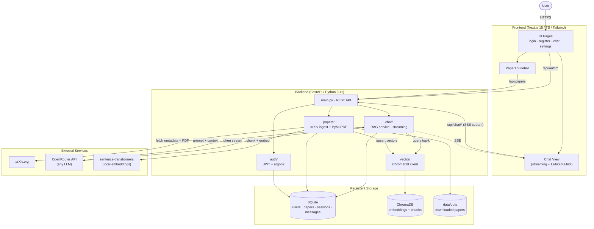

# RAG Research Assistant

A full-stack application for querying scientific papers using Retrieval-Augmented Generation (RAG) with vector search.

## Features

- 📄 **Paper Management** - Add arXiv papers to your personal library via URL
- 💬 **Chat Interface** - Ask questions about your papers with streaming responses
- 🔍 **Vector Search** - Semantic search using ChromaDB and sentence-transformers
- 📊 **LaTeX Support** - Mathematical formulas render as compiled equations
- 🔗 **Interactive Sources** - Click citations to open PDFs at specific pages
- 🎨 **Dark Theme** - Modern dark interface with Tailwind CSS
- 🔐 **User Authentication** - JWT-based authentication with secure password hashing
- ⚙️ **Model Selection** - Choose any OpenRouter model and use custom API keys

## Stack

| Layer | Technology |
|-------|------------|
| Frontend | Next.js 15, TypeScript, Tailwind CSS, shadcn/ui |
| Backend | FastAPI (Python 3.11) |
| Vector DB | ChromaDB with sentence-transformers |
| LLM | OpenRouter API (any model) |
| Auth | JWT + argon2 password hashing |
| arXiv | arxiv library + PyMuPDF for PDF parsing |
| Container | Docker + docker-compose |

## Architecture



**Request flows**

- **Ingest**: user submits arXiv URL → backend downloads PDF → PyMuPDF extracts text → chunked + embedded via `sentence-transformers` → vectors stored in ChromaDB, metadata in SQLite.
- **Chat**: user message → embed query → ChromaDB top-k retrieval → prompt assembled with context → OpenRouter LLM streamed back over SSE → rendered with KaTeX in the UI.
- **Auth**: JWT issued on login (argon2 hash); the token gates every `/api/*` route.

## Quick Start

### Prerequisites
- Docker and Docker Compose
- OpenRouter API key (get free at https://openrouter.ai)

### Setup

```bash
# 1. Clone and navigate
git clone <repo-url>
cd ragsystem

# 2. Configure environment
cp .env.example .env
# Edit .env and add your OpenRouter API key

# 3. Run with Docker
docker-compose build
docker-compose up
```

Access at `http://localhost:3000`

### Local Development

```bash
# Backend
cd backend
pip install -r requirements.txt
uvicorn main:app --reload

# Frontend (separate terminal)
cd frontend
npm install
npm run dev
```

## Usage

1. **Register** - Create account
2. **Add Papers** - Paste arXiv URLs in right sidebar
3. **Chat** - Ask questions about your papers
4. **Settings** - Choose model and add custom API key

## API Endpoints

- `POST /api/auth/register` - Register
- `POST /api/auth/login` - Login
- `GET /api/papers` - List papers
- `POST /api/papers` - Add paper
- `DELETE /api/papers/{id}` - Remove paper
- `POST /api/chat/sessions` - Create chat
- `POST /api/chat/sessions/{id}/messages` - Send message (streams)

## License

MIT
