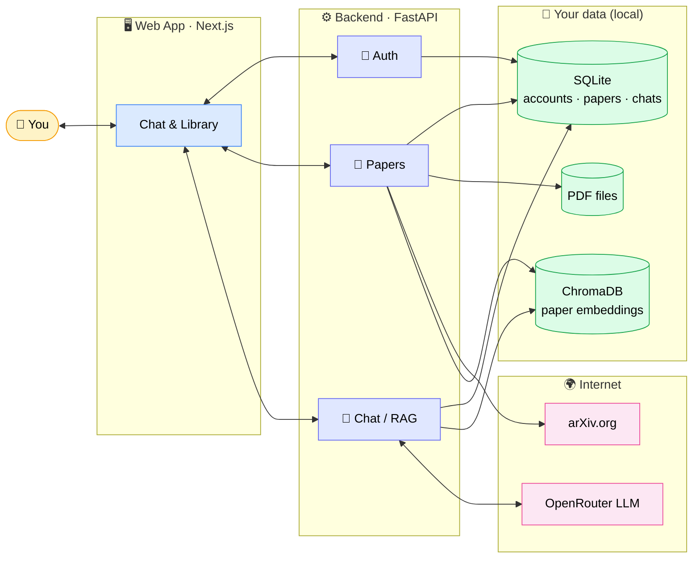

# RAG Research Assistant

A full-stack application for querying scientific papers using Retrieval-Augmented Generation (RAG) with vector search.

## Features

- 📄 **Paper Management** - Add arXiv papers to your personal library via URL
- 💬 **Chat Interface** - Ask questions about your papers with streaming responses
- 🔍 **Vector Search** - Semantic search using ChromaDB and sentence-transformers
- 📊 **LaTeX Support** - Mathematical formulas render as compiled equations
- 🔗 **Interactive Sources** - Click citations to open PDFs at specific pages
- 🎨 **Dark Theme** - Modern dark interface with Tailwind CSS
- 🔐 **User Authentication** - JWT-based authentication with secure password hashing
- ⚙️ **Model Selection** - Choose any OpenRouter model and use custom API keys

## Stack

| Layer | Technology |
|-------|------------|
| Frontend | Next.js 15, TypeScript, Tailwind CSS, shadcn/ui |
| Backend | FastAPI (Python 3.11) |
| Vector DB | ChromaDB with sentence-transformers |
| LLM | OpenRouter API (any model) |
| Auth | JWT + argon2 password hashing |
| arXiv | arxiv library + PyMuPDF for PDF parsing |
| Container | Docker + docker-compose |

## How it works

Here's the big picture — what talks to what:


```mermaid
flowchart LR
    User(["👤 You"])

    subgraph App["🖥️ Web App · Next.js"]
        UI["Chat &amp; Library"]
    end

    subgraph Server["⚙️ Backend · FastAPI"]
        Auth["🔐 Auth"]
        Papers["📄 Papers"]
        Chat["💬 Chat / RAG"]
    end

    subgraph Data["💾 Your data (local)"]
        DB[("SQLite<br/>accounts · papers · chats")]
        Vec[("ChromaDB<br/>paper embeddings")]
        Files[("PDF files")]
    end

    subgraph Web["🌍 Internet"]
        Arxiv["arXiv.org"]
        LLM["OpenRouter LLM"]
    end

    User <--> UI
    UI <--> Auth
    UI <--> Papers
    UI <--> Chat

    Auth --> DB
    Papers --> DB
    Papers --> Files
    Papers --> Arxiv
    Papers --> Vec

    Chat --> DB
    Chat --> Vec
    Chat <--> LLM

    classDef user fill:#fef3c7,stroke:#f59e0b,color:#000
    classDef app fill:#dbeafe,stroke:#3b82f6,color:#000
    classDef srv fill:#e0e7ff,stroke:#6366f1,color:#000
    classDef data fill:#dcfce7,stroke:#16a34a,color:#000
    classDef ext fill:#fce7f3,stroke:#ec4899,color:#000

    class User user
    class UI app
    class Auth,Papers,Chat srv
    class DB,Vec,Files data
    class Arxiv,LLM ext
```

### 📥 Adding a paper

1. You paste an arXiv URL in the sidebar.
2. The backend downloads the PDF and pulls the paper's metadata.
3. The text is split into small chunks and turned into embeddings — locally, with `sentence-transformers`.
4. Embeddings land in ChromaDB; the paper shows up in your library.

### 💬 Asking a question

1. You type a question in chat.
2. The backend embeds your question and finds the most relevant chunks across your papers (ChromaDB top-k search).
3. Those chunks plus your question are sent to the LLM via OpenRouter.
4. The answer streams back token-by-token, with clickable citations that jump to the exact PDF page.

> 🔐 Your account is gated by a JWT issued at login (password hashed with argon2). Everything except registration and login requires that token.

## Quick Start

### Prerequisites
- Docker and Docker Compose
- OpenRouter API key (get free at https://openrouter.ai)

### Setup

```bash
# 1. Clone and navigate
git clone <repo-url>
cd ragsystem

# 2. Configure environment
cp .env.example .env
# Edit .env and add your OpenRouter API key

# 3. Run with Docker
docker-compose build
docker-compose up
```

Access at `http://localhost:3000`

### Local Development

```bash
# Backend
cd backend
pip install -r requirements.txt
uvicorn main:app --reload

# Frontend (separate terminal)
cd frontend
npm install
npm run dev
```

## Usage

1. **Register** - Create account
2. **Add Papers** - Paste arXiv URLs in right sidebar
3. **Chat** - Ask questions about your papers
4. **Settings** - Choose model and add custom API key

## API Endpoints

- `POST /api/auth/register` - Register (`422` on a credential-policy failure, `429` when throttled)
- `POST /api/auth/login` - Login (`422` on an over-long password, `429` when throttled)
- `GET /api/papers` - List papers (`limit`, `offset`)
- `POST /api/papers` - Add paper
- `DELETE /api/papers/{id}` - Remove paper
- `POST /api/chat/sessions` - Create chat
- `GET /api/chat/sessions` - List chats (`limit`, `offset`)
- `GET /api/chat/sessions/{id}/messages` - List messages (`limit`, `offset`, `order`)
- `POST /api/chat/sessions/{id}/messages` - Send message (streams)

### Scoping a question to specific papers

`POST /api/chat/sessions/{id}/messages` accepts an optional `paper_ids` array of
integers. When present, retrieval is restricted to those papers; when absent or
empty, the whole library is searched, exactly as before.

```json
{ "content": "what dropout rate did they use?", "paper_ids": [3, 7] }
```

Ids that do not belong to the caller are ignored rather than rejected.

### Citations

Every source attached to an answer also carries the number the model was shown, and the evidence behind it:

| Field | Type | Description |
|-------|------|-------------|
| `label` | int | The `[n]` the model cited. One per distinct paper page, numbered contiguously from 1 |
| `snippet` | string | First 400 characters of the retrieved passage |
| `score` | float | Cosine similarity of the passage, ~0..1 |
| `chunk_count` | int | How many passages from that page were merged into this citation |

### Honesty about what was actually searched

The streaming `done` event additionally carries:

| Field | Type | Description |
|-------|------|-------------|
| `cited` | int[] | The labels the answer really used |
| `unresolved` | int[] | Labels it used that were not retrieved |
| `scope` | object | `{applied, paper_ids, paper_titles}` — what retrieval was restricted to |
| `coverage` | object \| null | `{total, covered, terms, missing, truncated}` — which of your question's key terms the retrieved pages contain. `null` when there were too few key terms to say anything meaningful |
| `coverage_line` | string \| null | The pre-rendered coverage line, worded and unit-tested server-side |
| `abstained` | bool | `true` when nothing was retrieved and **no model call was made at all** |
| `error` | string | Present only when the stream failed; the client must treat the `done` as terminal either way |

`coverage` is a lexical measurement of the retrieved text, not a confidence
score: a correct answer can score low when the paper words things differently,
and a wrong answer can score high by echoing your question.

**When retrieval returns nothing, the assistant refuses** rather than answering
from memory. The refusal is generated by the application — not by the model —
and is streamed as a normal answer, so no client change is needed to render it.
It costs nothing and contacts no provider.

Every field above is optional and additive: no route, no existing response field
and the `data: {...}` framing changed, so older clients keep working. The
persisted `sources` JSON is unchanged.

## Security configuration

A security-hardening pass added a handful of environment variables, one
fail-closed boot check and a real CORS policy. None of them removes an
existing route, field or behaviour — see [`SECURITY.md`](SECURITY.md) for the
full model, and [`NIGHT_REPORT.md`](NIGHT_REPORT.md) for the audit findings
they came from.

### `JWT_SECRET` is now required

The backend used to start happily with the shipped default
`change-me-in-production`, which is public in this repository: with it, anyone
could mint a valid token for any account. It now **refuses to start** while
`JWT_SECRET` is a known placeholder or is shorter than 32 characters, and it
does so before it opens the database:

```bash
python3 -c "import secrets;print(secrets.token_urlsafe(48))"   # paste into .env
```

The refusal names the variable and the rule it broke. It never prints the
value.

**Local development:** set `ALLOW_INSECURE_JWT_SECRET=true` to skip the check
and run with the placeholder. Never set it on a deployment — it is the switch
that turns the check off entirely.

### CORS

The backend used to be mounted with `allow_origins=["*"]`,
`allow_credentials=True`, `allow_methods=["*"]` and `allow_headers=["*"]`.
That let any page the user visited call the API on their behalf and read the
responses. It is now an explicit allow-list:

| Variable | Default | Meaning |
|---|---|---|
| `CORS_ALLOW_ORIGINS` | `http://localhost:3000,http://127.0.0.1:3000` | Comma-separated browser origins. At most 20. |
| `CORS_ALLOW_CREDENTIALS` | `false` | Only ever `true` alongside a specific origin list. |

Methods are narrowed to `GET`, `POST`, `DELETE`, `OPTIONS`, headers to
`Authorization` and `Content-Type`, and preflights are cached for 10 minutes.
Setting `CORS_ALLOW_ORIGINS=""` installs no CORS middleware at all, which is
the right setting when the frontend is served from the same origin. `"*"`
together with `CORS_ALLOW_CREDENTIALS=true` is rejected at boot.

### All new variables

| Variable | Default | Purpose |
|---|---|---|
| `ALLOW_INSECURE_JWT_SECRET` | `false` | Local-dev only. Skips the `JWT_SECRET` boot check. |
| `LLM_ALLOW_PRIVATE_HOSTS` | `false` | Whether a user-supplied LLM `base_url` may resolve to loopback/private addresses. |
| `CORS_ALLOW_ORIGINS` | `http://localhost:3000,http://127.0.0.1:3000` | Browser origins allowed by CORS. |
| `CORS_ALLOW_CREDENTIALS` | `false` | Send cookies/`Authorization` cross-origin. |
| `LOG_LEVEL` | `INFO` | Root level of the `ragapp` logger (`DEBUG`…`CRITICAL`). |
| `AUTH_LOGIN_RATE_LIMIT` / `AUTH_LOGIN_RATE_WINDOW` | `10` / `60` | Login throttle per account, attempts per seconds. |
| `AUTH_LOGIN_IP_RATE_LIMIT` / `AUTH_LOGIN_IP_RATE_WINDOW` | `30` / `60` | Login throttle per source IP. |
| `AUTH_REGISTER_RATE_LIMIT` / `AUTH_REGISTER_RATE_WINDOW` | `5` / `300` | Registration throttle per source IP. |

Every one of them is already in [`.env.example`](.env.example), and every
default is the strict one — an unconfigured deployment is the safer one.

There is now application logging, so `docker-compose logs backend` shows a
startup line, the CORS decision, and any auth failures. Nothing sensitive is
logged: the boot checks report variable names and rules, never values.

### Rate limiting: `429` and `Retry-After`

`POST /api/auth/login` and `POST /api/auth/register` are throttled. The
throttle runs **before** the database query and before argon2, because the
cost being defended is the hash and checking the budget afterwards would leave
it exactly where it was.

| Endpoint | Window | Key |
|---|---|---|
| `POST /api/auth/login` | 10 attempts / 60 s | per (source IP, lower-cased username) |
| `POST /api/auth/login` | 30 attempts / 60 s | per source IP |
| `POST /api/auth/register` | 5 attempts / 300 s | per source IP |

The per-account window resets on a successful login, so three typos and a
correct password is not a lockout. The per-IP window does **not** reset on
success — it exists to bound a host, and refilling it on demand would hand an
attacker a reset button.

A throttled request returns:

```http
HTTP/1.1 429 Too Many Requests
Retry-After: 42

{"detail":"Too many attempts. Try again later."}
```

`Retry-After` is in whole seconds and is never `0`. The message is identical
for all three windows: the client learns *that* it is throttled and *when* to
come back, not which window it hit — that would leak the shape of the limit.
The frontend surfaces a non-2xx `detail` verbatim, so this message reaches the
login form with no frontend change.

⚠️ The limiters are **in-process**, so `uvicorn --workers N` multiplies every
limit by N, and a restart resets the counters. Behind a reverse proxy, the
source address must come from a header the proxy **overwrites**; one that
passes a client-supplied `X-Forwarded-For` through lets an attacker mint a
fresh per-IP budget per request.

### Credential policy at registration

`POST /api/auth/register` returns **`422`** when the submitted username or
password fails the policy, and the `detail` is the policy's own sentence.

| Field | Rule | Example response `detail` |
|---|---|---|
| `username` | 3–32 characters, no whitespace | `Username must be at least 3 characters.` |
| `password` | 12–256 characters | `Password must be at most 256 characters.` |

Length is deliberately the only rule — no composition requirement, because
those reliably produce `Password1!`, which is in every published cracking
dictionary, while a 12+ character passphrase is not. A 12-character password of
nothing but spaces is therefore accepted; treat the floor as the removal of
trivially guessable credentials, not as a strength guarantee.

**The floor is not applied to login.** Only the 256-character ceiling is. A
`422` about password *length* on the login endpoint would separate "wrong
password" from "malformed request" and hand an attacker a free oracle about
the stored credential. The ceiling stays because an unbounded password is a
CPU-exhaustion primitive against the server's argon2.

### Bounded list endpoints

`GET /api/papers`, `GET /api/chat/sessions` and
`GET /api/chat/sessions/{id}/messages` are paged. Each takes:

| Parameter | Default | Range | Applies to |
|---|---|---|---|
| `limit` | `200` | 1–200 | all three |
| `offset` | `0` | ≥ 0 | all three |
| `order` | `asc` | `asc` \| `desc` | messages only |

The **default is the cap**: asking for nothing returns at most 200 rows, and
there is no value meaning "give me the whole table" — `limit=0` or
`limit=201` is a `422`. Responses are still bare JSON arrays with unchanged
fields; only their maximum length changed.

Rows are ordered before they are bounded — by `id` for papers, by
`updated_at DESC, id DESC` for sessions, by `created_at, id` for messages — so
`id` breaks timestamp ties and a page is a stable set.

`order=desc` on the messages endpoint selects the **newest** `limit` rows and
then re-sorts them oldest-first before serialising. `LIMIT/OFFSET` count from
the start of the ordering, so ascending order cannot reach the tail at all; this
is the standard last-page idiom, and it is what the chat UI uses to load a long
conversation's most recent turns. Paging is `O(offset)`, so deep pages get
progressively slower.

All of the above is additive: no route, method, response field or status code
that previously succeeded changes. For the threat model behind each control,
the residual risks that are still open, and an explicit per-finding list of what
was executed versus only reasoned about, read
[`SECURITY.md`](SECURITY.md). The shortest useful summary is that the security
modules themselves are unit-tested and run, while the router wiring, the boot
path and the whole frontend were reviewed but never executed — the runtime
dependencies are not installed in the environment this was written in.

## License

MIT
